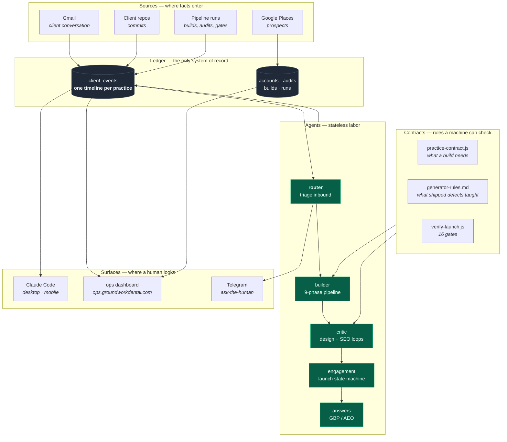
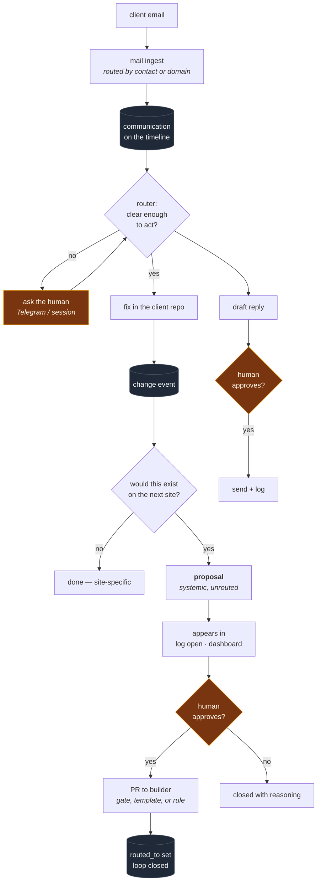

# How the business runs

The system that sources practices, builds their sites, launches them, and
absorbs what each build teaches.

This document exists because the alternative is a conversation that has to
rediscover the shape of things every time. It is written for an agent as much
as a person: if you are an agent starting work here, this is the map.

---

## The one rule

> **State lives in the ledger. Agents hold none.**

If an agent knows something the database does not, that knowledge dies when
the session ends. Every failure this system has had was that: seventy files of
finished work stranded in a working tree, ten of twelve rules adopted and two
forgotten, a stale `intake.json` believed by the next reader, a dashboard
pointed at a database that moved.

Nothing below is interesting except as a consequence of that rule.

---

## Layers

Read it as: **sources write facts, the ledger holds them, contracts constrain
what agents may do, agents do the work and write back, surfaces read.** No
arrow skips the ledger.

---

## The two builds

The single most important distinction in the system. They differ in what
credentials exist, not in what code runs.

```mermaid
flowchart LR
    subgraph COLD[" Cold build — Groundwork credentials only "]
        direction TB
        C1[source a practice] --> C2[audit the live site]
        C2 --> C3[crawl → silver → merge]
        C3 --> C4[generate + design loop]
        C4 --> C5[16 launch gates]
        C5 --> C6[preview on Groundwork CF]
        C6 --> C7[pitch page]
    end

    subgraph ENG[" Engagement build — client credentials "]
        direction TB
        E1[$500 deposit] --> E2[Pages → client CF]
        E2 --> E3[domain + DNS cutover]
        E3 --> E4[$2,000 paid]
        E4 --> E5[GBP OAuth · GA4 · GSC]
        E5 --> E6[repo handoff]
        E6 --> E7[preview decommission]
    end

    C7 -->|client says yes| E1

    classDef auto fill:#064e3b,stroke:#10b981,color:#ecfdf5
    classDef human fill:#78350f,stroke:#f59e0b,color:#fffbeb
    class C1,C2,C3,C4,C5,C6,C7 auto
    class E1,E2,E3,E4,E5,E6,E7 human
```

Green runs unattended. Amber cannot: every step needs a credential only the
practice can grant, and GBP API access is gated behind a 60-day organization
age. **The engagement build is a state machine with human checkpoints, not an
autonomous agent** — and trying to make it one is how you get code written
against documentation that nobody can test for two months.

---

## The feedback loop

What happens when a client says something. This is the loop that makes the
next build better rather than repeating the last one's mistakes.

Three things are deliberate:

**A change cannot close untriaged.** `systemic = null` keeps it on `log open`.
The triage question is the one thing that reliably gets skipped once the
client's problem is solved, so it is a field rather than a habit.

**A systemic change cannot close unrouted.** Marking something general without
saying where the general fix lives is how rules 4 and 5 sat unadopted for a
week while a document claimed twelve rules were handled.

**The router may implement in a client repo. It may not implement in the
builder or the website.** A client fix is scoped and reversible. A builder
change reaches every future practice. A website change is a public claim. Those
need a human, so the router writes a proposal instead.

---

## Where the money and the risk are

| Stage | Automatable | Why |
|---|---|---|
| Sourcing | yes | read-only, public data |
| Audit | yes | read-only |
| Cold build | yes | Groundwork infrastructure only |
| QC gates | yes | deterministic, no tokens |
| Pitch | yes | nothing published in a client's name |
| **Outreach** | **draft only** | a message in your name to a stranger |
| **Engagement** | **no** | client credentials, DNS, irreversible |
| **GBP writes** | **no** | published claims about a real business |
| Post-launch reporting | yes | read-only |

The pattern: **anything that publishes a claim in someone else's name stops at
a draft.** That is the same rule the build enforces internally — `provenance`
with no default, `affiliation` declared rather than assumed, `approved: true`
before a send.

---

## Repositories

| Repo | Holds | Touched by |
|---|---|---|
| `groundwork-builder` | pipeline, agents, contracts, gates, template | every agent |
| `groundworkdental` | the marketing site | human, with proposals |
| `clients/<slug>` | one practice's site | router + engagement |
| `groundwork-answers` | AEO/GBP content loop *(paused)* | answers agent |

A session attaches **the builder plus whatever it is working on** — not
everything. A session holding every repo is one that can change the wrong one.

---

## Surfaces

Both read the same ledger. Neither is the source of truth.

- **Claude Code** — the working surface. Desktop for changes, mobile for
  triage and approvals, because attaching a repo is a desktop action.
- **ops dashboard** — the looking surface. What is in the queue, what is
  waiting on you, without opening a session and asking.
- **Telegram** — the interrupt. Only for the ask-the-human branch, because a
  notification you receive during dinner should be one that actually needs
  you.
